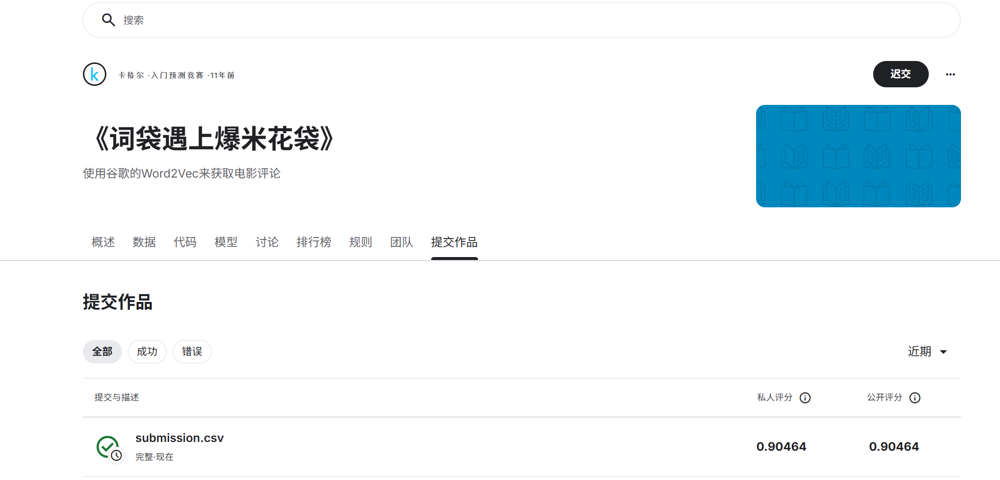

# 机器学习实验：基于 Word2Vec 的情感预测

## 1. 学生信息
- **姓名**：高静雯
- **学号**：112304260110
- **班级**：数据1231

---

## 2. 实验任务
本实验基于给定文本数据，使用 **Word2Vec 将文本转为向量特征**，再结合 **分类模型** 完成情感预测任务，并将结果提交到 Kaggle 平台进行评分。

本实验重点包括：
- 文本预处理
- Word2Vec 词向量训练或加载
- 句子向量表示
- 分类模型训练
- Kaggle 结果提交与分析

---

## 3. 比赛与提交信息
- **比赛名称**：Bag of Words Meets Bags of Popcorn
- **比赛链接**：https://www.kaggle.com/competitions/word2vec-nlp-tutorial/overview
- **提交日期**：2026-04-16

- **GitHub 仓库地址**：https://github.com/Gao-0102/112304260110gjw
- **GitHub README 地址**：https://github.com/Gao-0102/112304260110gjw/blob/main/README.md

---

## 4. Kaggle 成绩
请填写你最终提交到 Kaggle 的结果：

- **Public Score**：0.90464
- **Private Score**（如有）：0.90464
- **排名**（如能看到可填写）：

---

## 5. Kaggle 截图
请在下方插入 Kaggle 提交结果截图，要求能清楚看到分数信息。

---

## 6. 实验方法说明

### （1）文本预处理

**我的做法：**  
- 移除 HTML 标签
- 处理缩写形式（如 don't -> do not）
- 转为小写
- 保留情感相关的标点（感叹号、问号）
- 移除停用词，但保留否定词（not, no, never等）
- 简单词干提取

---

### （2）Word2Vec 特征表示

**我的做法：**  
- 使用自己训练的 Word2Vec 模型
- 词向量维度为 300
- 句子向量通过对文本中所有词的词向量取平均得到

---

### （3）分类模型

**我的做法：**  
- 双 TF-IDF + 逻辑回归模型（使用短语模式）
- Word2Vec + 逻辑回归模型
- 最终采用了模型集成（平均融合）

---

## 7. 实验流程

**我的实验流程：**  
1. 读取训练集和测试集
2. 对文本进行预处理（去HTML标签、处理缩写、小写化、保留否定词等）
3. 训练 Word2Vec 模型
4. 提取双 TF-IDF 特征（词级+字符级，使用短语模式）
5. 提取 Word2Vec 特征
6. 训练多个逻辑回归模型
7. 7折分层交叉验证评估模型性能
8. 模型集成（平均融合）
9. 生成 submission 文件并提交 Kaggle

---

## 8. 文件说明

**我的项目结构：**
- `src/`：存放源代码
- `image/`：存放 README 中使用的图片
- `submission/`：存放提交文件

